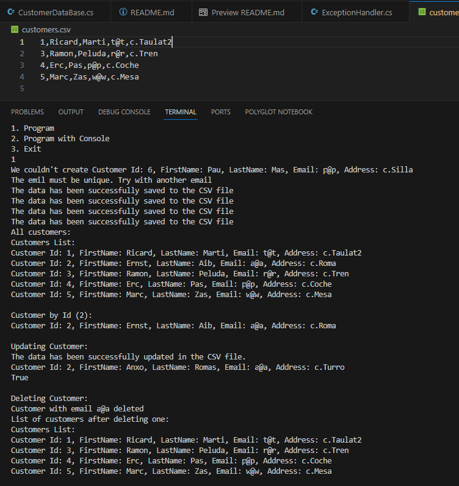

# Customer Database Management

Assignment to practice Database Management with C#.

The Program has the following options in the Main menu:

    1. Program:
    - All methods are called in Program.cs
    - Displays solutions in the console
    - Update the file customers.csv

    2. Program with Console (notice that update CSV  file not implemented here)
    - Allows to the user change fields through  the console
        Main Menu of 2. Program with Console:
        1. Add new customer
            FirtsName:
            LastName:
            Email:
            Address:
        2. Show all customers
            Displays all customers
        3. Search customer by Id
            Enter the Id of the customer you want to search for: 4
        4. Delete customer by email
            Introduce an email to delete customer:
        5. Update customers fields
            Introduce an email to update customer:
                Write the number option to proceed
                    1. Update First Name
                    2. Update Last Name
                    3. Update email
                    4. Update Address
                    5. Return to the main Menu
        6. Undo
        7. Exit

    3. Exit

## Screenshot of the Results of option 1. Program

### After selecting 1

### Part 1

#### Part 2

## Assignment

You are tasked with building a customer database application that can store and retrieve customer information. The application should allow users to add, update, delete, and search for customers using various criteria. In addition, the application should be designed to handle large amounts of data efficiently, so it should utilize appropriate structures and algorithms.

## Requirements

Information of all the customers should be stored in a file called `customers.csv`. Initially, the program should read all the data from file and add data to the database. Any modification to the database should also recorded in the file `customers.csv`. The basic classes would be needed for this project (and create more if you have valid reasons to do so):

1. Create `Customer` class: This class represents a customer and should contain properties such as Id, FirstName, LastName, Email, and Address. You can decide the suitable data types for each.
2. Create `CustomerDatabase` class: This class should contain the data structure used to store customer information, such as a collection of customers. It should also contain methods for adding, reading, updating, deleting. Extra features:
   - Email should be unique in the database.
   - Implement a feature to search customers by their ID
   - Implement an undo and redo feature which allows users to undo their last action or redo an action that they have undone
3. Create `FileHelper` class: This class should contain methods for reading and writing customer information to and from the file system.
4. Create `ExceptionHandler` class: This class should contain methods for handling exceptions that may occur during the execution of the application.
